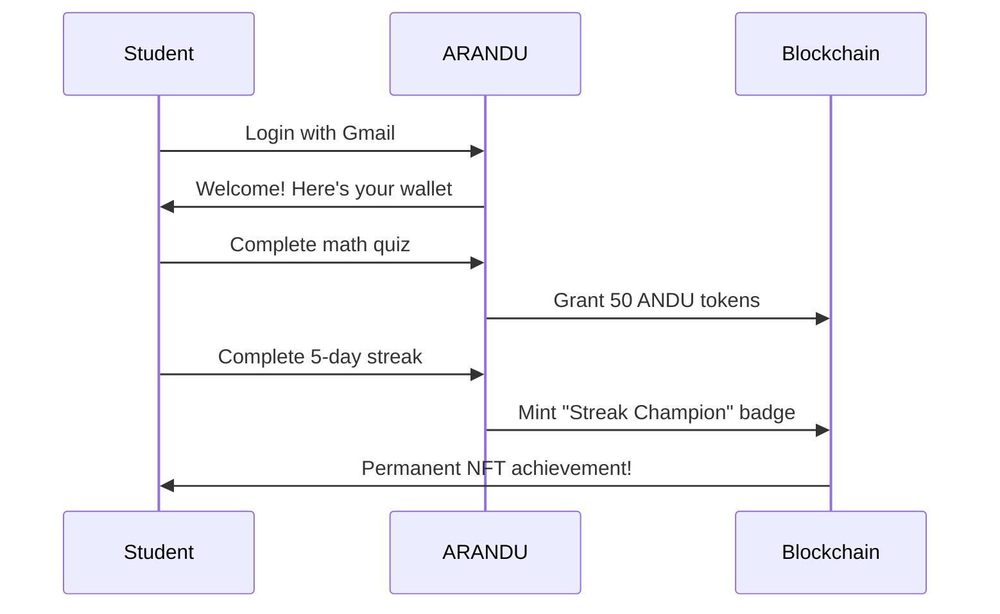
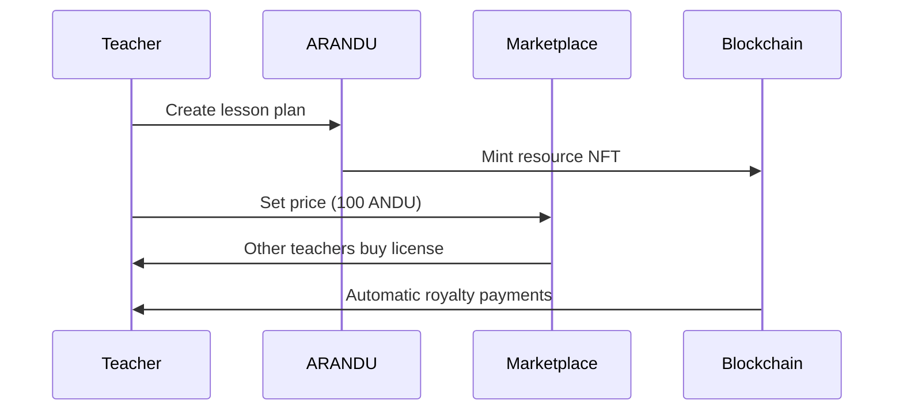

# ARANDU 🇧🇴

## *Transforming Education Through Blockchain - One Student at a Time*

[](./test)
[](https://soliditylang.org/)
[](https://sepolia-blockscout.lisk.com/)
[](./LICENSE)

> **ARANDU** is a gamified educational platform for Latin America that uses blockchain to create transparent, motivating, and rewarding ecosystems for students and teachers.

---

## 🎯 **The Problem**

**2.8 million Bolivian students** are trapped in an underfunded education system where:

- Teachers earn $200/month with no resources or recognition
- 40% dropout rate not because kids can't learn, but because the system fails them
- Zero innovation while every other industry transforms

## ✨ **Our Solution**

ARANDU transforms education into an **adventure economy** where:

### For Students 🎓

- **🎮 Gamified Learning**: Every lesson earns real ANDU tokens
- **🏆 Achievement Badges**: Soulbound NFTs for verified accomplishments  
- **📜 Permanent Credentials**: Blockchain certificates that follow them forever

### For Teachers 👨‍🏫

- **💼 Content Monetization**: Turn lesson plans into income streams
- **🤝 Global Collaboration**: Access and share resources across borders
- **📊 Automated Recognition**: Smart contracts handle rewards and tracking

---

## 🏗️ **Architecture**

### Smart Contracts (6 Total)

```bash
📦 ARANDU Ecosystem
├── 💰 ANDUToken (ERC20) - Internal economy currency
├── 🎁 AranduRewards - Orchestrator for all rewards  
├── 🎓 AranduCertificates (ERC721) - Soulbound credentials
├── 📚 AranduResources (ERC1155) - Content marketplace
├── 🏆 AranduBadges (ERC721) - Achievement gamification
└── 🔗 DataAnchor - Transparency & verification
```

### Tech Stack

- **Blockchain**: Lisk Sepolia (EVM-compatible, low gas fees)
- **Smart Contracts**: Solidity ^0.8.20 with OpenZeppelin
- **Testing**: Hardhat + Ethers.js + Chai (85 tests passing)
- **Frontend Ready**: Web3Auth integration for Gmail login

---

## 🚀 **Live Deployment**

### Lisk Sepolia Testnet

```bash
✅ ANDUToken           : 0xc518353025E46b587e424c4aBa6b260E4dB21322
✅ AranduCertificates  : 0x60d4525Fe706c4CE938A415b2B8bC2a7f8b2f64c  
✅ AranduBadges        : 0x0275c991DfE3339da93a5aecbB162BE4A9D152C4
✅ AranduRewards       : 0x401DFD0a403245a2111B9Dac127B2815feBB3dfA
✅ AranduResources     : 0x49bcaF572905BC08cdE35d2658875a9BFA52838a
✅ DataAnchor          : 0x9aDb12a7448B32836b526D7942Cc441fF91a6d3D
```

**🔍 Verify on Explorer**: [View Contracts](https://sepolia-blockscout.lisk.com/address/0xc518353025E46b587e424c4aBa6b260E4dB21322)

---

## ⚡ **Quick Start**

### 1. Clone & Install

```bash
git clone <repository-url>
cd arandu_app
yarn install
```

### 2. Run Tests

```bash
yarn test
# 85 tests passing ✅
```

### 3. Deploy Locally

```bash
yarn chain            # Start local blockchain
yarn deploy:local     # Deploy all contracts
```

### 4. Deploy to Lisk Sepolia

```bash
# Add your private key to wallet-1.json (encrypted)
yarn deploy:testnet
```

---

## 🎮 **How It Works**

### Student Journey



### Teacher Journey



---

## 🧪 **Testing**

### Comprehensive Test Suite

- **📊 85 tests passing** with 100% core functionality coverage
- **🔧 Unit Tests**: Individual contract testing
- **🔗 Integration Tests**: Cross-contract workflows  
- **👥 User Story Tests**: Complete user journeys

```bash
yarn test                   # Run all tests
yarn test:integration      # Run integration tests
```

### Test Categories

- **HU01-HU04**: Core integration tests (Teacher, Student, Admin flows)
- **HU05-HU07**: Advanced features (Gamification, Professional Development, Transparency)
- **Unit Tests**: Individual contract validation

---

## 🎯 **Key Features**

### 🎮 **Automatic Gamification**

- **Streak Champion**: 5 consecutive days → Badge NFT
- **Token Master**: 1000 ANDU earned → Badge NFT  
- **Certificate Collector**: 5 certificates → Badge NFT
- **Real-time Detection**: Smart contracts automatically mint achievements

### 🔐 **Role-Based Access**

- **ADMIN_ROLE**: Platform management
- **TEACHER_ROLE**: Verified educators
- **MINTER_ROLE**: Authorized token minting
- **Web3Auth Integration**: Gmail → Ethereum wallet seamlessly

### 💰 **Token Economics**

- **Fixed Supply**: 1,000,000 ANDU tokens
- **Reward Distribution**: Automated via AranduRewards contract
- **Content Marketplace**: Teachers earn from resource sales
- **Transparent Tracking**: All transactions on-chain

---

## 🌐 **Market Impact**

### Target Market

- **120 million students** across Latin America
- **$240 billion education market** opportunity
- **First-mover advantage** in blockchain education for LATAM

### Social Impact

- **Dropout Prevention**: Gamification increases engagement
- **Teacher Empowerment**: New income streams from content creation
- **Transparent Education**: Blockchain-verified achievements and data

---

## 🏆 **Hackathon Alignment**

### Bounty Compatibility

- **✅ ENS/Crecimiento**: Public good infrastructure for LATAM education
- **✅ Lisk**: Real-world application leveraging low gas fees  
- **✅ V0 Vercel**: Beautiful, accessible UI ready for enhancement

### Technical Excellence

- **Production-Ready**: Complete deployment on Lisk Sepolia
- **Secure**: OpenZeppelin standards + comprehensive testing
- **Scalable**: Built for millions of users with efficient gas usage
- **User-Friendly**: Web3Auth enables Gmail-based blockchain access

---

## 📁 **Project Structure**

```bash
arandu_app/
├── 📂 contracts/           # 6 Smart Contracts (245 lines max)
├── 📂 test/               # 85 tests organized by user stories  
├── 📂 scripts/            # Deployment and interaction scripts
├── 📂 abis/               # Contract ABIs by network
├── 📂 src/components/     # Web3Auth React integration
└── 📂 docs/               # Technical documentation
```

---

## 🛠️ **Development**

### Prerequisites

- Node.js 18+
- Hardhat
- MetaMask or compatible wallet

### Environment Setup

```bash
cp env.example .env
# Add your configuration
```

### Available Scripts

```bash
yarn compile         # Compile contracts
yarn test           # Run all tests
yarn deploy:local   # Deploy to local network
yarn chain          # Start local blockchain
```

---

## 🤝 **Contributing**

We welcome contributions! Please see our [contributing guidelines](./docs/CONTRIBUTING.md).

### Development Workflow

1. Fork the repository
2. Create feature branch: `git checkout -b feature/amazing-feature`
3. Run tests: `yarn test`
4. Commit changes: `git commit -m 'Add amazing feature'`
5. Push to branch: `git push origin feature/amazing-feature`
6. Open Pull Request

---

## 📄 **License**

This project is licensed under the MIT License - see the [LICENSE](./LICENSE) file for details.

## 📚 **Documentation**

- **[Technical Guide](./docs/TECHNICAL.md)** - Smart contract architecture and implementation
- **[Deployment Guide](./docs/DEPLOYMENT.md)** - Live contract addresses and deployment info
- **[Contributing](./CONTRIBUTING.md)** - How to contribute to the project
- **[Hackathon Submission](./HACKATHON-SUBMISSION.md)** - Aleph Hackathon 2025 details

---

## 🌟 **Team**

Built with ❤️ for the **Aleph Hackathon 2025** by the ARANDU team.

**Contact**: <moisescisnerosdl@gmail.com>

---

## 🚀 **Live Demo**

**🎬 Watch our 3-minute demo**: [Demo Video Link]

**🔗 Try it live**: [Frontend URL when available]

**📊 View contracts**: [Lisk Sepolia Explorer](https://sepolia-blockscout.lisk.com/address/0xc518353025E46b587e424c4aBa6b260E4dB21322)

---

*"Every badge we mint is a dream we're helping achieve. Every token we distribute is hope we're delivering. Every certificate we issue is a life we're changing."*

**Join us. Let's turn every classroom in Latin America into a launchpad for greatness.** 🚀
