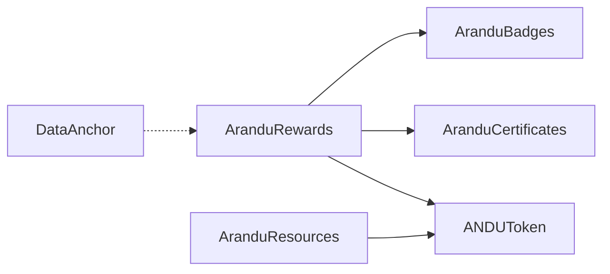

# ARANDU Technical Documentation

## 🏗️ **Smart Contract Architecture**

### Core Contracts

| Contract | Purpose | Type | Key Features |
|----------|---------|------|-------------|
| `ANDUToken` | Platform currency | ERC20 + AccessControl | Role-based minting, fixed supply |
| `AranduRewards` | Reward orchestrator | Custom | Automatic badge detection, multi-reward |
| `AranduCertificates` | Student credentials | ERC721 Soulbound | Non-transferable, verifiable |
| `AranduResources` | Content marketplace | ERC1155 + ERC2981 | Master/License tokens, royalties |
| `AranduBadges` | Achievement system | ERC721 Soulbound | Gamification, non-transferable |
| `DataAnchor` | Transparency layer | Custom | Immutable data verification |

### Contract Interactions



## 🎮 **Gamification System**

### Automatic Badge Rewards

- **Streak Champion**: 5 consecutive daily activities
- **Token Master**: 1000 ANDU tokens earned
- **Certificate Collector**: 5 certificates completed

### Implementation

```solidity
function grantTokenReward(address student, uint256 amount, bool isStreak) external onlyOwner {
    // Transfer tokens
    token.transfer(student, amount);
    
    // Update tracking
    studentTokensEarned[student] += amount;
    
    // Handle streak logic
    if (isStreak) _updateStreak(student);
    
    // Check for automatic badge rewards
    _checkAndGrantBadges(student);
}
```

## 🔐 **Security & Access Control**

### Role System (ANDUToken)

- **ADMIN_ROLE**: Platform management
- **TEACHER_ROLE**: Verified educators  
- **MINTER_ROLE**: Authorized minting (AranduRewards)

### Trusted Backend Pattern

- Backend controls all critical functions via `onlyOwner`
- Users don't pay gas directly
- Simplified UX while maintaining security

## 🌐 **Frontend Integration**

### Web3Auth Setup

```jsx
import { Web3AuthProvider } from './components/Web3AuthProvider';
import { AranduContractProvider } from './components/AranduContractProvider';

function App() {
  return (
    <Web3AuthProvider>
      <AranduContractProvider>
        <StudentDashboard />
      </AranduContractProvider>
    </Web3AuthProvider>
  );
}
```

### Contract Interaction

```javascript
// Complete activity and earn rewards
const { getStudentData, completeActivity } = useAranduContracts();

// Student completes quiz
await completeActivity("math-quiz-1", answers, true); // isStreak = true

// Smart contract automatically:
// 1. Grants ANDU tokens
// 2. Updates streak count  
// 3. Checks for badge eligibility
// 4. Mints badge if threshold reached
```

## 📊 **Deployment Information**

### Lisk Sepolia Testnet

```json
{
  "network": "lisk-sepolia",
  "chainId": 4202,
  "rpc": "https://rpc.sepolia-api.lisk.com",
  "explorer": "https://sepolia-blockscout.lisk.com",
  "contracts": {
    "ANDUToken": "0xc518353025E46b587e424c4aBa6b260E4dB21322",
    "AranduRewards": "0x401DFD0a403245a2111B9Dac127B2815feBB3dfA",
    "AranduBadges": "0x0275c991DfE3339da93a5aecbB162BE4A9D152C4",
    "AranduCertificates": "0x60d4525Fe706c4CE938A415b2B8bC2a7f8b2f64c",
    "AranduResources": "0x49bcaF572905BC08cdE35d2658875a9BFA52838a",
    "DataAnchor": "0x9aDb12a7448B32836b526D7942Cc441fF91a6d3D"
  }
}
```

### Gas Optimization

- **Low fees on Lisk**: ~$0.001 per transaction
- **Batch operations**: Multiple teacher onboarding
- **Efficient storage**: Packed structs for student data

## 🧪 **Testing**

### Test Coverage

- **85 tests passing** across all user stories
- **Unit tests**: Individual contract validation
- **Integration tests**: Cross-contract workflows
- **User story tests**: Complete user journeys (HU01-HU07)

### Run Tests

```bash
yarn test                # All tests
yarn test:integration   # Integration tests
```

## 🎯 **Key Innovations**

1. **Gmail to Blockchain**: Web3Auth enables seamless onboarding
2. **Automatic Achievements**: Smart contracts detect and reward progress
3. **Soulbound Credentials**: Permanent, non-transferable achievements
4. **Teacher Economy**: Content creators earn from peer purchases
5. **Transparent Data**: Blockchain-anchored educational metrics

---

## 📈 **Market Opportunity**

- **Target**: 120M students across Latin America
- **Market Size**: $240B education sector
- **Growth**: 15% annual increase in education spending
- **First Mover**: No blockchain education platform in LATAM

---

## 🏆 **Hackathon Impact**

### Bounty Alignment

- **Public Good**: Open-source educational infrastructure
- **Real-World App**: Solves actual education problems at scale
- **Mass Adoption**: Grandmother-friendly blockchain interaction

### Social Impact

- **Dropout Prevention**: Gamification increases student engagement
- **Teacher Empowerment**: New economic opportunities
- **Educational Transparency**: Verifiable achievements and data

---

*Built for **Aleph Hackathon 2025** - Proving LATAM leads the blockchain revolution* 🚀
