# ARANDU Contracts Architecture & Dependencies

## 🏗️ Contract Dependency Diagram


## 📊 Contract Interaction Matrix

| Contract               | ANDUToken    | AranduRewards   | AranduCertificates | AranduResources | AranduBadges | DataAnchor |
| ---------------------- | ------------ | --------------- | ------------------ | --------------- | ------------ | ---------- |
| **ANDUToken**          | -            | ✅ Transfer      | ❌                  | ✅ Payment       | ❌            | ❌          |
| **AranduRewards**      | ✅ Distribute | -               | ✅ Issue            | ❌               | ❌            | ❌          |
| **AranduCertificates** | ❌            | ✅ Controlled by | -                  | ❌               | ❌            | ❌          |
| **AranduResources**    | ✅ Payments   | ❌               | ❌                  | -               | ❌            | ❌          |
| **AranduBadges**       | ❌            | ❌               | ❌                  | ❌               | -            | ❌          |
| **DataAnchor**         | ❌            | ❌               | ❌                  | ❌               | ❌            | -          |

---

## 🎮 AranduBadges: Gamification System Explained

### What is AranduBadges?

**AranduBadges** is an ERC721 contract that manages **soulbound NFT badges** for ARANDU’s gamification system. These badges represent special achievements earned by students when completing specific challenges.

### Key Features

1. **Soulbound NFTs**: Cannot be transferred once granted
2. **Special Achievements**: Streaks, milestones, competitions
3. **Motivation**: Learning gamification
4. **Verifiable**: On-chain proof of achievements

### Specific Use Cases



```mermaid
sequenceDiagram
    participant S as Student
    participant BE as Backend
    participant AB as AranduBadges
    participant F as Frontend

    Note over S,F: Scenario: 5-day consecutive streak
    
    S->>F: Complete daily mission (day 5)
    F->>BE: POST /complete-mission
    BE->>BE: Detect 5-day streak milestone
    BE->>AB: safeMint(student, "Streak Champion")
    AB->>AB: _nextTokenId++ (e.g., tokenId = 3)
    AB->>AB: _safeMint(student, 3)
    AB->>AB: badgeName[3] = "Streak Champion"
    AB-->>BE: Badge minted successfully
    BE-->>F: Milestone achieved!
    F-->>S: 🎉 "Streak Champion" Badge earned!

    Note over S,F: Student attempts to transfer badge
    S->>AB: transfer(friend, 3)
    AB->>AB: Check: from != address(0) && to != address(0)
    AB-->>S: Revert: "Badges are soulbound" ❌
```

### Example Badge Types

| Badge Name             | Trigger            | Description                |
| ---------------------- | ------------------ | -------------------------- |
| "Streak Champion"      | 5 consecutive days | Consistency in learning    |
| "Quiz Master"          | 10 perfect quizzes | Academic excellence        |
| "Helper Hero"          | Help 5 peers       | Collaboration & leadership |
| "Course Completionist" | Finish full course | Dedication & perseverance  |

---

## 🔗 DataAnchor: Transparency & Verification Explained

### What is DataAnchor?

**DataAnchor** is a utility contract that allows **anchoring critical data hashes** on the blockchain to ensure transparency and immutability in the educational ecosystem.

### Key Features

1. **Immutable Records**: Anchored data cannot be modified
2. **Timestamp Verification**: Automatic timestamping
3. **Publisher Tracking**: Records the publisher of each hash
4. **Transparency**: Anyone can verify data

### Specific Use Cases


### Anchored Data Types

| Data Type           | Frequency    | Purpose                   |
| ------------------- | ------------ | ------------------------- |
| Education Barometer | Monthly      | Transparency of metrics   |
| Certificate Batches | Per issuance | Authenticity verification |
| Academic Results    | Quarterly    | Grade auditing            |
| System Updates      | Per release  | Change traceability       |

---

## 🌐 Frontend Integration

### Integration Architecture

```mermaid
graph LR
    subgraph "🖥️ Frontend (Next.js/React)"
        UI[User Interface]
        WC[Wallet Connect]
        API[API Client]
    end
    
    subgraph "⚙️ Backend (Node.js/Express)"
        AUTH[Authentication]
        BL[Business Logic]
        BC[Blockchain Client]
    end
    
    subgraph "⛓️ Blockchain (Lisk L2)"
        AT[ANDUToken]
        AR[AranduRewards]
        AC[AranduCertificates]
        ARes[AranduResources]
        AB[AranduBadges]
        DA[DataAnchor]
    end
    
    subgraph "🌐 External Services"
        IPFS[IPFS/Pinata]
        DB[(Database)]
    end

    %% Frontend to Backend
    UI --> API
    WC --> AUTH
    
    %% Backend to Blockchain
    BL --> BC
    BC --> AT
    BC --> AR
    BC --> AC
    BC --> ARes
    BC --> AB
    BC --> DA
    
    %% External Services
    BL --> IPFS
    BL --> DB
    
    %% Data Flow
    API -.-> BL
    AUTH -.-> BL
```



### Integration Flows by Actor

#### 👨‍🏫 Teacher Creator


#### 🎓 Student

```mermaid
sequenceDiagram
    participant UI as Frontend UI
    participant API as Backend API
    participant BC as Blockchain Client
    participant AR as AranduRewards
    participant AB as AranduBadges

    Note over UI,AB: Complete daily activity
    UI->>API: POST /activities/complete<br/>{activityId, answers}
    API->>API: Validate answers + calculate score
    API->>BC: grantTokenReward(student, amount)
    BC->>AR: grantTokenReward() [onlyOwner]
    AR-->>BC: Tokens granted
    
    alt Milestone achieved (e.g., 5-day streak)
        API->>BC: mintBadge(student, "Streak Champion")
        BC->>AB: safeMint() [onlyOwner]
        AB-->>BC: Badge minted
        BC-->>API: Badge created
        API-->>UI: 🎉 Badge earned!
    else Regular completion
        BC-->>API: Tokens granted
        API-->>UI: ✅ Activity completed + tokens
    end
```



#### 🛒 Teacher Consumer

```mermaid
sequenceDiagram
    participant UI as Frontend UI
    participant WC as Wallet Connect
    participant API as Backend API
    participant ARes as AranduResources
    participant AT as ANDUToken

    Note over UI,AT: Browse and purchase workflow
    UI->>API: GET /marketplace/resources
    API-->>UI: Available resources list
    UI->>UI: User selects resource
    
    UI->>WC: Request wallet connection
    WC-->>UI: Wallet connected
    
    UI->>WC: Request token approval
    WC->>AT: approve(AranduResources, amount)
    AT-->>WC: Approval confirmed
    WC-->>UI: Approval successful
    
    UI->>API: POST /purchase/license<br/>{resourceId, quantity}
    API->>ARes: buyLicenses(tokenId, quantity)
    ARes->>AT: transferFrom(buyer, creator, cost)
    ARes->>ARes: Transfer licenses
    ARes-->>API: Purchase successful
    API-->>UI: License acquired ✅
```



### Suggested Frontend Components

#### 1. Dashboard Components

```jsx
// components/Dashboard/StudentDashboard.jsx
export function StudentDashboard() {
  const { balance, certificates, badges } = useStudentData();
  
  return (
    <div className="dashboard">
      <TokenBalance balance={balance} />
      <CertificateGallery certificates={certificates} />
      <BadgeCollection badges={badges} />
      <ActivityFeed />
    </div>
  );
}
```

#### 2. Marketplace Components

```jsx
// components/Marketplace/ResourceCard.jsx
export function ResourceCard({ resource }) {
  const { purchaseLicense } = useResourcePurchase();
  
  return (
    <div className="resource-card">
      <ResourcePreview resource={resource} />
      <PriceDisplay price={resource.price} />
      <PurchaseButton onPurchase={() => purchaseLicense(resource.id)} />
    </div>
  );
}
```

#### 3. Gamification Components

```jsx
// components/Gamification/BadgeNotification.jsx
export function BadgeNotification({ badge }) {
  return (
    <motion.div className="badge-notification">
      <BadgeIcon badge={badge} />
      <h3>🎉 New Badge Unlocked!</h3>
      <p>{badge.name}</p>
      <ShareButton badge={badge} />
    </motion.div>
  );
}
```

### Suggested Backend APIs

```javascript
// routes/student.js
app.post('/api/student/complete-activity', async (req, res) => {
  const { studentId, activityId, answers } = req.body;
  
  // Validate answers
  const score = validateAnswers(answers, activityId);
  
  // Grant token reward
  const tokenAmount = calculateReward(score);
  await blockchainClient.grantTokenReward(studentId, tokenAmount);
  
  // Check for milestones
  const milestone = await checkMilestones(studentId);
  if (milestone) {
    await blockchainClient.mintBadge(studentId, milestone.badgeName);
  }
  
  res.json({ success: true, score, tokenAmount, milestone });
});

// routes/marketplace.js
app.post('/api/marketplace/purchase', async (req, res) => {
  const { resourceId, quantity, buyerAddress } = req.body;
  
  try {
    const tx = await blockchainClient.buyLicenses(resourceId, quantity);
    await tx.wait();
    
    res.json({ success: true, transactionHash: tx.hash });
  } catch (error) {
    res.status(400).json({ error: error.message });
  }
});
```

---

✅ This translation keeps all technical terminology, smart contract names, and diagrams intact, while adapting the explanatory text to clear professional English.
