# Sequence Diagrams - ARANDU User Stories

This document describes the flows of the main User Stories in the ARANDU system using sequence diagrams.

## General Architecture

The ARANDU system follows a **Trusted Backend** pattern where:

* A centralized backend controls the "owner" addresses of the contracts
* Critical functions are protected with `onlyOwner`
* Users interact primarily through the frontend/backend, not directly with the contracts

---

## US01: Teacher as Creator - Resource Creation and Management

**Story:** "As a Creator Teacher, I want to register my educational content on the platform, manage it, and receive payment when someone purchases a license, so I can be rewarded for my work."

### Main Flow: Create and Sell Resource


---

## US02: Student as Learner - Gamified Learning Journey

**Story:** "As a Student, I want to access educational content, complete activities, and receive rewards for my progress, to stay motivated in my learning."

### Main Flow: Complete Activity and Receive Rewards

```mermaid
sequenceDiagram
    participant S as Student
    participant F as Frontend
    participant B as Backend
    participant AR as AranduRewards
    parameter AT as ANDUToken
    participant AC as AranduCertificates

    Note over S,AC: 1. Access Content
    S->>F: Login to platform
    F->>B: GET /student-dashboard
    B-->>F: Available content + progress
    F-->>S: Dashboard with activities

    Note over S,AC: 2. Complete Activity
    S->>F: Complete learning activity
    F->>B: POST /complete-activity
    B->>B: Validate completion
    B->>B: Calculate rewards

    Note over S,AC: 3. Grant Token Rewards
    B->>AR: grantTokenReward(student, amount)
    AR->>AT: transfer(student, amount)
    AT-->>AR: Transfer success
    AR-->>B: Reward granted
    
    Note over S,AC: 4. Grant Certificate (if applicable)
    alt Major milestone completed
        B->>AR: issueCertificate(student, uri)
        AR->>AC: safeMint(student, uri, "student")
        AC-->>AR: Certificate issued
        AR-->>B: Certificate granted
    end

    B-->>F: Rewards processed
    F-->>S: Congratulations! Rewards received
```

---

## US03: System as Admin - Platform Management

**Story:** "As the System/Admin, I want to manage the platform, distribute rewards, and maintain the integrity of the educational ecosystem."

### Main Flow: Initial Setup and Treasury Management


---

## US04: Teacher as Consumer - Professional Development

**Story:** "As a Consumer Teacher, I want to access resources created by other teachers, acquire licenses, and use the content to improve my teaching."

### Main Flow: Discover and Purchase Resources


---

## US05: Gamification Lifecycle - Streak System

**Story:** "As the System, I want to implement a daily streak system that rewards students' consistency with tokens and special badges."

### Main Flow: Daily Streak System

```mermaid
sequenceDiagram
    participant S as Student
    participant F as Frontend
    participant B as Backend
    participant AT as ANDUToken
    participant AB as AranduBadges

    Note over S,AB: 1. Regular Daily Mission (Days 1-4)
    S->>F: Complete daily mission
    F->>B: POST /complete-mission
    B->>B: Check streak count
    B->>AT: mint(student, daily_reward)
    AT-->>B: Tokens granted
    B->>B: Update streak counter
    B-->>F: Mission completed (streak: N/5)
    F-->>S: Tokens received! Streak progress

    Note over S,AB: 2. Streak Milestone (Day 5)
    S->>F: Complete 5th consecutive mission
    F->>B: POST /complete-mission
    B->>B: Detect 5-day streak milestone
    
    Note over S,AB: 3. Special Rewards
    B->>AT: mint(student, daily_reward + bonus)
    AT-->>B: Bonus tokens granted
    B->>AB: safeMint(student, "Streak Champion")
    AB-->>B: Badge minted
    B->>B: Reset streak counter
    B-->>F: Milestone achieved!
    F-->>S: 🎉 Streak Champion Badge + Bonus Tokens!

    Note over S,AB: 4. Duplicate Prevention
    alt Student tries to claim same mission
        S->>F: Attempt duplicate mission
        F->>B: POST /complete-mission
        B->>B: Check mission already completed today
        B-->>F: Mission already completed
        F-->>S: Already completed today
    end
```



---

## US06: Teacher Professional Development - Certification Path

**Story:** "As a Teacher, I want to complete professional development courses and receive NFT certifications that validate my pedagogical growth."

### Main Flow: Complete Course and Receive Certification

```mermaid
sequenceDiagram
    participant T as Teacher
    participant F as Frontend
    participant B as Backend
    participant AT as ANDUToken
    participant AC as AranduCertificates

    Note over T,AC: 1. Course Enrollment
    T->>F: Browse professional courses
    T->>F: Enroll in course
    F->>B: POST /enroll-course
    B->>B: Register enrollment
    B-->>F: Enrollment confirmed
    F-->>T: Course access granted

    Note over T,AC: 2. Course Progress
    loop Course modules
        T->>F: Complete module
        F->>B: POST /complete-module
        B->>B: Track progress
        B->>AT: mint(teacher, module_reward)
        AT-->>B: Module reward granted
        B-->>F: Module completed
        F-->>T: Progress updated + tokens
    end

    Note over T,AC: 3. Final Assessment
    T->>F: Take final assessment
    F->>B: POST /submit-assessment
    B->>B: Grade assessment
    
    alt Assessment passed
        Note over T,AC: 4. Professional Certification
        B->>AC: safeMint(teacher, certificate_uri, "teacher")
        AC-->>B: Certificate issued
        B->>AT: mint(teacher, completion_bonus)
        AT-->>B: Completion bonus granted
        B-->>F: Course completed + certified
        F-->>T: 🎓 Professional Certificate Earned!
    else Assessment failed
        B-->>F: Assessment failed
        F-->>T: Retake required
    end

    Note over T,AC: 5. Credential Verification
    T->>F: View my certificates
    F->>B: GET /my-certificates
    B->>AC: Check teacher's certificates
    AC-->>B: Certificate list
    B-->>F: Certificate portfolio
    F-->>T: Display verified credentials
```



---

## US07: Data Transparency Anchor - Blockchain Verification

**Story:** "As the System, I want to anchor important data hashes on blockchain to guarantee transparency and immutability in the educational ecosystem."

### Main Flow: Anchoring Critical Data


---

## Implementation Considerations

### Security

* All critical functions are protected with `onlyOwner`
* Soulbound tokens (certificates and badges) are non-transferable
* The reward system is centralized to prevent abuse

### Scalability

* Contracts are designed to be gas-efficient
* Complex logic is handled off-chain by the backend
* Metadata is stored on IPFS to reduce costs

### User Experience

* Users do not pay gas directly
* Transactions are handled by the trusted backend
* The interface abstracts blockchain complexity

### Auditability and Transparency

* All important events emit logs on-chain
* Critical data hashes are anchored for verification
* The system enables independent audits of transactions
